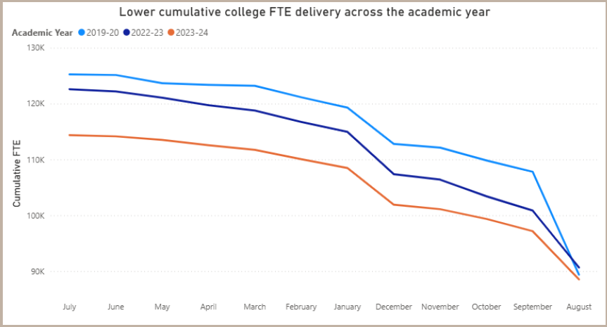
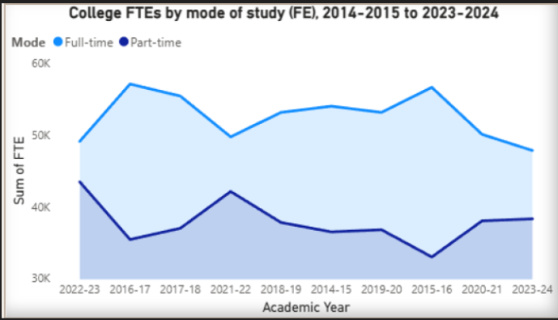
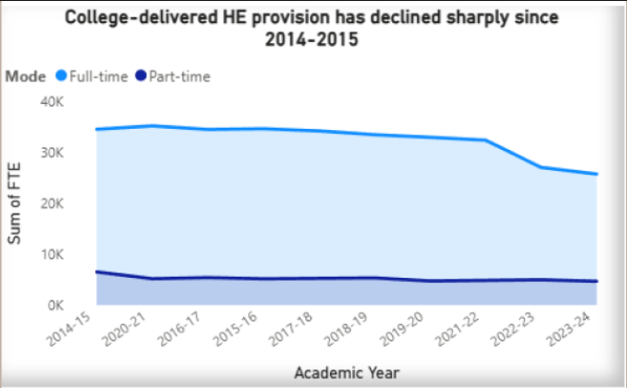
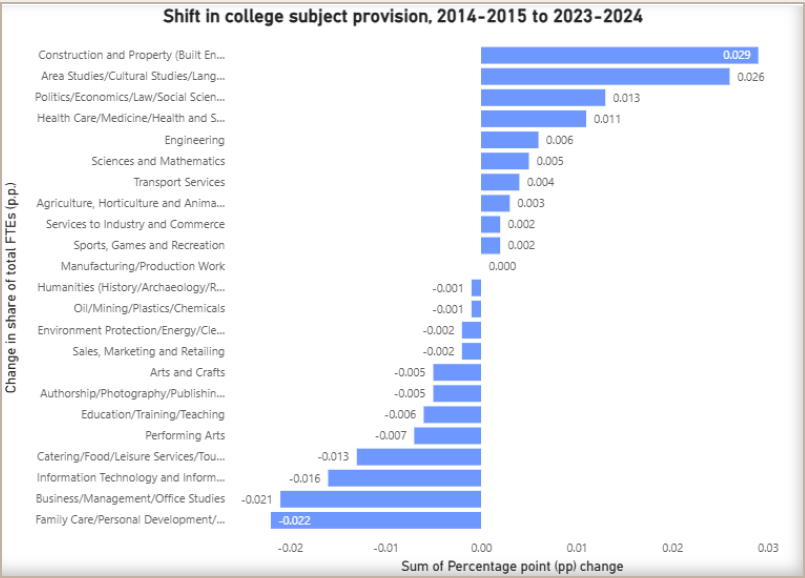

# lifelong-learning-scotland
Data story and visualisations on lifelong learning (college FTE trends) in Scotland, 2014-2015 to 2023-2024

# Lifelong Learning in Scotland (College FTE Trends)

This repository contains a short **data story** and **visualisations** on lifelong learning provision in Scotland, using **college Full-Time Equivalent (FTE)** trends from **2014–2015 to 2023-2024**.  
It highlights how provision has changed over time and why those changes matter for adult learners, reskilling, and access to education.

## What this project covers
The analysis focuses on:
- Changes in lifelong learning **provision over time** (FE and college-based HE)
- Differences by **mode of study** (full-time vs part-time)
- Shifts in **subject availability**
- Changes in **flexibility across the academic year** (how learning is delivered across months)

## Key questions
- How has lifelong learning provision changed since 2014–15?
- Which routes (especially part-time learning) have declined most?
- How has subject access changed over the decade?
- Has learning become less flexible across the year?

## Snapshot findings (summary)
- Lifelong learning provision shows a **declining trend** across the decade.
- A sharp fall in **part-time FE in 2023–24** may reduce access for learners balancing work/caring responsibilities.
- Subject mix shifted: growth in **construction, health, engineering, languages**; decline in **business, IT, tourism, personal services**.
- Delivery patterns suggest **reduced flexibility** (fewer late-entry opportunities).

## Visuals

### Declining lifelong learning provision (FE + HE)
.png)

### Flexibility (cumulative delivery)

### FTE by mode (FE)

### HE decline

### Subject shift

## Source report
- [`Lifelong_Learning.pdf`](Lifelong_Learning.pdf)]

---

## Author
Roksolana Stefanyshyn: [(https://www.linkedin.com/notifications/?filter=all)]
